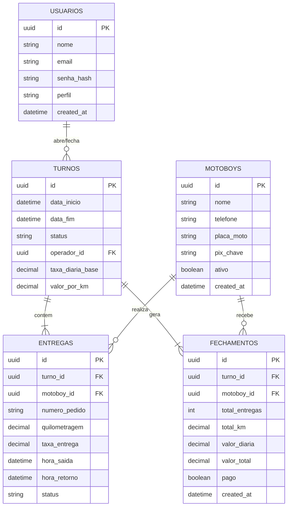

# 🗄️ Modelagem do Banco de Dados — MotoFlow

> **Objetivo:** Estruturar as entidades, relacionamentos e tipos de dados do banco relacional (ex: PostgreSQL / Supabase) que sustentará a aplicação MotoFlow.

---

## 1. Diagrama Entidade-Relacionamento (ERD)

---

## 2. Dicionário de Dados das Tabelas

### 👤 Tabela: `usuarios` (Operadores e Administradores)
| Campo | Tipo | Nulo | Descrição |
| :--- | :--- | :---: | :--- |
| `id` | `UUID` | Não | Chave primária única. |
| `nome` | `VARCHAR(100)` | Não | Nome completo do operador/gerente. |
| `email` | `VARCHAR(150)` | Não | E-mail para autenticação (único). |
| `senha_hash` | `TEXT` | Não | Senha criptografada (bcrypt/argon2). |
| `perfil` | `VARCHAR(20)` | Não | `operador`, `gerente` ou `admin`. |
| `created_at` | `TIMESTAMP` | Não | Data de cadastro. |

---

### 🏍️ Tabela: `motoboys` (Cadastro dos Entregadores)
| Campo | Tipo | Nulo | Descrição |
| :--- | :--- | :---: | :--- |
| `id` | `UUID` | Não | Chave primária única. |
| `nome` | `VARCHAR(100)` | Não | Nome do motoboy. |
| `telefone` | `VARCHAR(20)` | Sim | WhatsApp/telefone de contato. |
| `placa_moto` | `VARCHAR(10)` | Sim | Placa da motocicleta. |
| `pix_chave` | `VARCHAR(100)` | Sim | Chave PIX para pagamento de fechamento. |
| `ativo` | `BOOLEAN` | Não | Se o motoboy está ativo para turnos (default: `true`). |

---

### ⏱️ Tabela: `turnos` (Sessão Diária de Operação)
| Campo | Tipo | Nulo | Descrição |
| :--- | :--- | :---: | :--- |
| `id` | `UUID` | Não | Chave primária. |
| `data_inicio` | `TIMESTAMP` | Não | Horário de abertura do turno. |
| `data_fim` | `TIMESTAMP` | Sim | Horário de encerramento do turno. |
| `status` | `VARCHAR(20)` | Não | `aberto` ou `fechado`. |
| `taxa_diaria_base` | `DECIMAL(10,2)` | Não | Valor fixo da diária no turno. |
| `valor_por_km` | `DECIMAL(10,2)` | Não | Valor pago por quilômetro rodado. |

---

### 📦 Tabela: `entregas` (Corridas Realizadas)
| Campo | Tipo | Nulo | Descrição |
| :--- | :--- | :---: | :--- |
| `id` | `UUID` | Não | Chave primária. |
| `turno_id` | `UUID` | Não | Chave estrangeira referenciando `turnos(id)`. |
| `motoboy_id` | `UUID` | Não | Chave estrangeira referenciando `motoboys(id)`. |
| `numero_pedido` | `VARCHAR(50)` | Sim | Número do pedido ou comanda fiscal. |
| `quilometragem` | `DECIMAL(8,2)` | Não | KM total da corrida. |
| `hora_saida` | `TIMESTAMP` | Não | Timestamp do momento da saída. |
| `status` | `VARCHAR(20)` | Não | `em_rota`, `concluida` ou `cancelada`. |

---

### 💰 Tabela: `fechamentos` (Consolidado Financeiro do Turno)
| Campo | Tipo | Nulo | Descrição |
| :--- | :--- | :---: | :--- |
| `id` | `UUID` | Não | Chave primária. |
| `turno_id` | `UUID` | Não | FK referenciando `turnos(id)`. |
| `motoboy_id` | `UUID` | Não | FK referenciando `motoboys(id)`. |
| `total_entregas` | `INTEGER` | Não | Quantidade total de corridas no turno. |
| `total_km` | `DECIMAL(10,2)` | Não | Soma de KMs percorridos. |
| `valor_total` | `DECIMAL(10,2)` | Não | Valor final calculado para pagamento. |
| `pago` | `BOOLEAN` | Não | Status de confirmação do pagamento. |