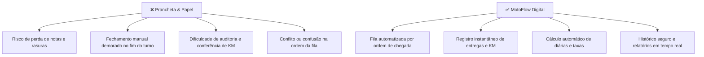

# 🎯 Visão do Projeto — MotoFlow

> **"O que estamos construindo e por quê?"**  
> **Slogan:** *Gestão Inteligente de Entregadores*  
> **Cliente Piloto:** Babbo Giovanni  

---

## 1. Visão Geral

O **MotoFlow** é uma aplicação web desenvolvida para digitalizar, controlar e automatizar a gestão de entregadores próprios em restaurantes e pizzarias.

A primeira versão (MVP) atende diretamente à operação da **Babbo Giovanni**, onde o controle de chegadas, fila, saídas para entrega, quilometragem e fechamento de diárias hoje é realizado em pranchetas físicas com caneta e papel.

Após a validação prática no cliente piloto, o sistema será expandido para modelo **SaaS multiempresa**.

---

## 2. O Problema Atual vs. A Solução MotoFlow

---

## 3. Público-Alvo

### 🛵 Cliente Piloto (V1)
* **Babbo Giovanni:** Validação da rotina diária real de operação intensa.

### 🍕 Mercado Futuro (V2 e V3)
* Pizzarias e Hamburguerias com frota própria de motoboys.
* Restaurantes de sushi e comida árabe com delivery próprio.
* Franquias gastronômicas e centros de distribuição local.

---

## 4. Benefícios por Perfil de Usuário

| Usuário | Benefícios Principais |
| :--- | :--- |
| **🏢 Restaurante / Dono** | Redução de até 80% do tempo de fechamento de caixa, zero perda de informações e visão de métricas diárias. |
| **🏍️ Motoboys** | Transparência total sobre suas corridas realizadas, km acumulado e valor exato a receber. |
| **🧑‍💻 Operador / Expedição** | Fila visível na tela em tablet/computador, chamadas rápidas e sem atrito na expedição. |

---

## 5. Diferencial Competitivo

> O **MotoFlow não nasceu de suposições teóricas**, mas da observação e vivência direta da rotina e das dores da operação na linha de frente do delivery. Cada botão e fluxo foi projetado para a correria do horário de pico.

---

## 6. Fases de Evolução (Roadmap Estratégico)

| Fase | Versão | Foco Principal |
| :---: | :---: | :--- |
| **1** | **V1 (MVP)** | Operação Babbo Giovanni (Fila, Entregas, Fechamento de Caixa). |
| **2** | **V2** | Ajustes de usabilidade e relatórios avançados baseados no uso diário. |
| **3** | **V3** | Arquitetura Multiempresa (Multi-tenant com isolamento de dados). |
| **4** | **V4** | Plataforma SaaS comercial com planos de assinatura mensal. |

---

## 7. Métricas de Sucesso (KPIs)

* ⏱️ **Tempo de Fechamento:** Reduzir o tempo de fechamento do turno de 40 minutos para menos de 3 minutos.
* 📝 **Eliminação do Papel:** 100% dos turnos registrados digitalmente.
* 🔍 **Auditoria Instantânea:** Acesso a qualquer entrega do histórico em 1 clique.
