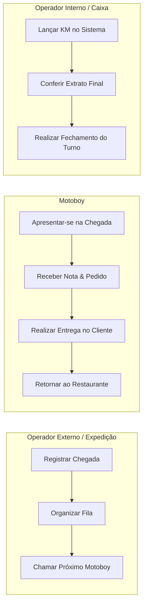

# ⚖️ Regras de Negócio (RN) — MotoFlow

> **Objetivo:** Definir com precisão como a operação do restaurante funciona na prática, garantindo que a lógica de programação respeite fielmente o fluxo de trabalho real.

---

## 📌 RN-01 — Entrada e Início de Turno do Motoboy
* Cada motoboy realiza **apenas uma entrada por turno**.
* Ao chegar ao estabelecimento, o motoboy se apresenta à expedição e o operador registra seu nome.
* O sistema registra automaticamente a **hora de entrada**.
* A ordem de chegada define rigorosamente a **posição inicial na fila**.

---

## 📌 RN-02 — Dinâmica da Fila de Espera (FIFO - First In, First Out)
* O primeiro motoboy que chega é o **primeiro a sair para entrega**.
* Quando o motoboy do topo da fila recebe um pedido e sai:
  1. Ele é removido do topo da fila.
  2. Seu status muda para `Em Rota`.
  3. O segundo motoboy da fila assume automaticamente a **1ª posição**.
* Ao retornar da entrega, o motoboy é reintegrado no **final da fila**.
* A fila **nunca pode reordenar automaticamente** sem uma ação explícita da operação.

---

## 📌 RN-03 — Distribuição de Pedidos e Notas
* Cada entrega é atribuída a **apenas um motoboy**.
* Antes de sair, o motoboy recebe a nota fiscal ou comanda do pedido contendo:
  * Número do pedido / mesa / comanda;
  * Endereço de destino;
  * Quilometragem calculada ou estimada;
  * Nome do motoboy responsável anotado na via física.

---

## 📌 RN-04 — Registro da Entrega e KM
* A expedição lança no sistema a entrega associando:
  * Motoboy responsável;
  * Quilometragem (KM) percorrida na corrida;
  * Horário de saída.
* Uma entrega confirmada soma imediatamente na contagem de corridas daquele motoboy no turno ativo.

---

## 📌 RN-05 — Imutabilidade após Fechamento
* Após a finalização e fechamento do turno, **nenhuma quilometragem ou entrega pode ser alterada** sem autorização explícita de um usuário administrador/gerente.

---

## 📌 RN-06 — Cálculo de Fechamento de Caixa
Ao encerrar o turno diário, o sistema calcula automaticamente para cada motoboy:

$$\text{Total a Receber} = \text{Diária Fixa} + (\text{Total de Entregas} \times \text{Taxa Base}) + (\text{Total KM} \times \text{Valor por KM})$$

* A tela exibe o extrato detalhado para conferência mútua entre operador e motoboy.

---

## 📌 RN-07 — Matriz de Responsabilidades

