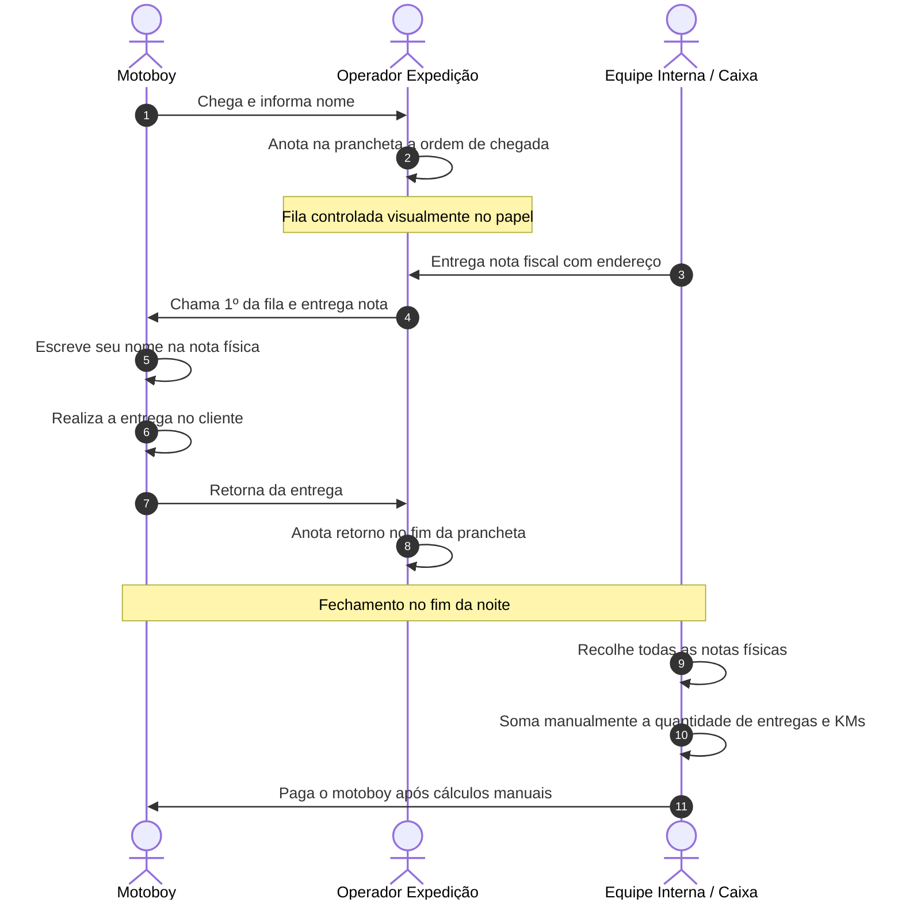
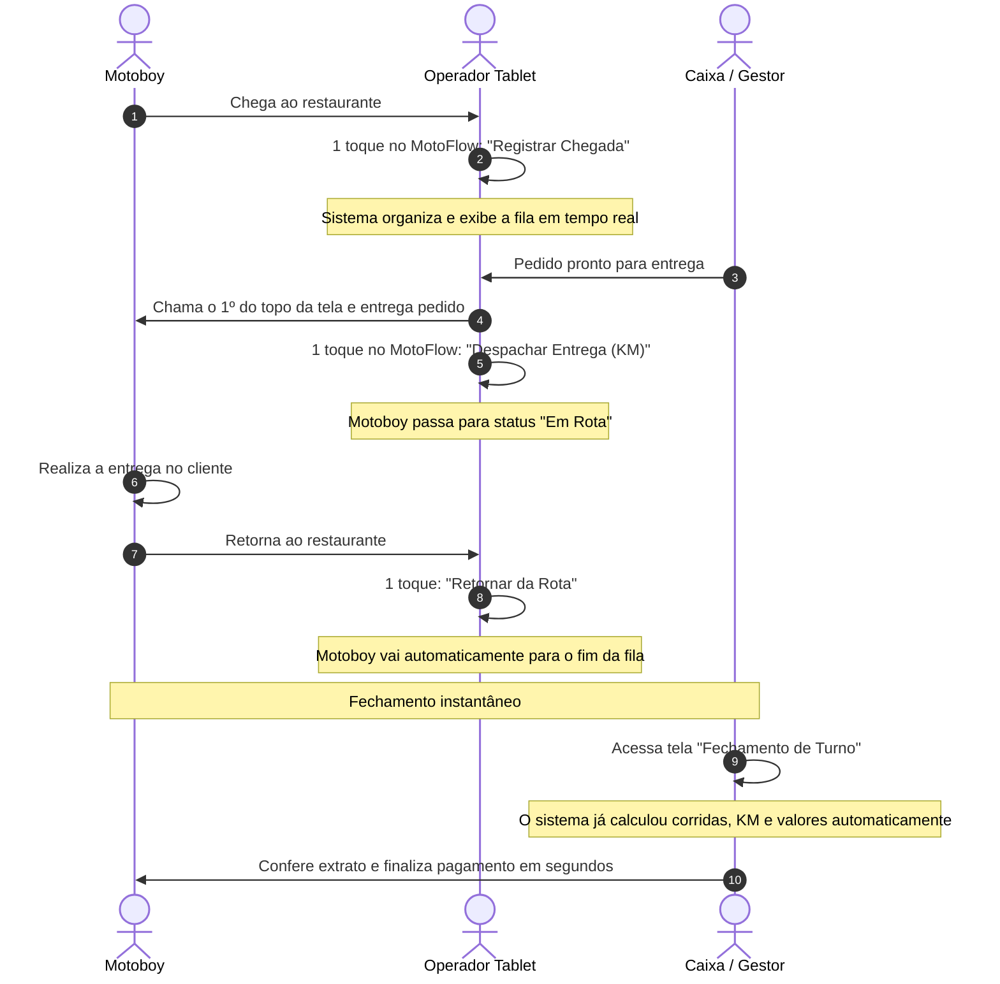
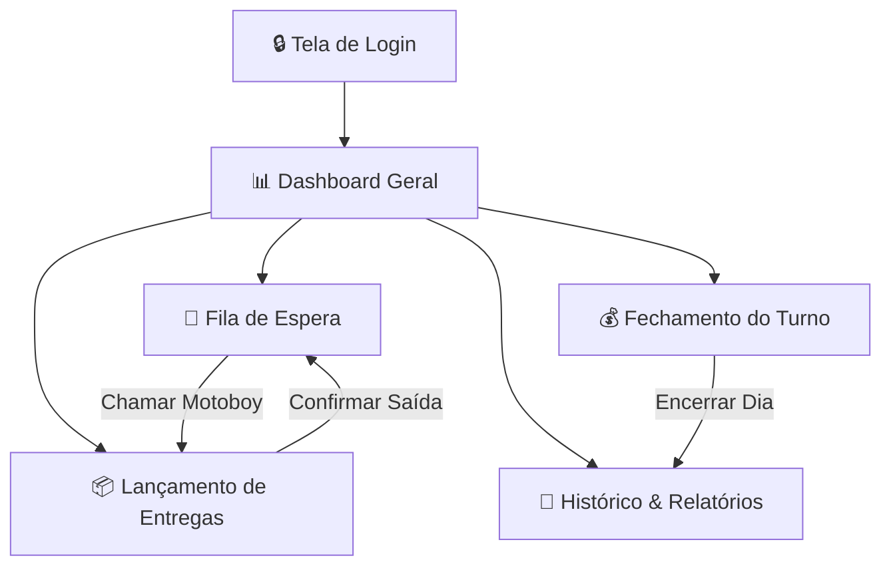

# 🔄 Fluxo da Operação — MotoFlow

> **Objetivo:** Comparar o fluxo de trabalho físico/manual tradicional com o fluxo digitalizado pelo MotoFlow, garantindo que o sistema simplifique o processo sem gerar atrito na rotina da equipe.

---

## 1. Fluxo Operacional Tradicional (Manual / Prancheta)

Hoje, a operação na Babbo Giovanni funciona com papel e caneta:

---

## 2. Fluxo Operacional Otimizado (Com MotoFlow)

Com o **MotoFlow**, a prancheta de papel é 100% substituída pelo painel digital:

---

## 3. Mapa de Navegação das Telas do Sistema

