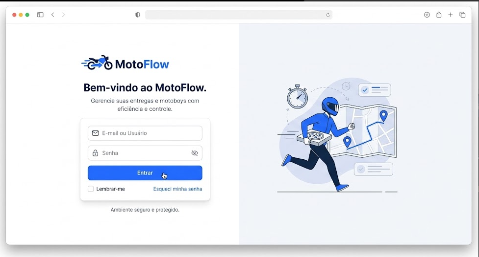

# 📐 Wireframes e Estrutura das Telas — MotoFlow

> **Objetivo:** Especificar os elementos visuais, objetivos e comportamento de cada uma das 5 telas principais do MotoFlow.

---

## 🖥️ Visão Geral das Telas

1. 🔒 **Login** (`/login`)
2. 📊 **Dashboard** (`/dashboard`)
3. 👥 **Fila de Espera** (`/fila`)
4. 📦 **Registrar Entrega** (`/entregas`)
5. 💰 **Fechamento de Turno** (`/fechamento`)

---

## 1. Tela 1 — Login (`/login`)

* **Usuário:** Operador interno, operador de expedição ou administrador.
* **Objetivo:** Acesso rápido e seguro à plataforma.
* **Elementos Principais:**
  * Logotipo oficial do MotoFlow;
  * Campo de e-mail/usuário e senha;
  * Botão de login largo e destacado (`#1E63FF`);
  * *(Futuro)* Opção de PIN rápido de 4 dígitos para troca rápida de operador.

---

## 2. Tela 2 — Dashboard Principal (`/dashboard`)

* **Objetivo:** Visão 360º da operação em tempo real (deve ser compreensível em 3 segundos).
* **Elementos Principais:**
  * **Card 1 (Métrica):** Total de motoboys ativos no turno.
  * **Card 2 (Métrica):** Entregas realizadas no dia.
  * **Card 3 (Métrica):** Entregas ativas em rota no momento.
  * **Card 4 (Métrica):** Quilometragem acumulada.
  * **Seção de Acesso Rápido:** Botões largos "Chamar Próximo", "Nova Entrega", "Encerrar Turno".

---

## 3. Tela 3 — Fila de Espera (`/fila`)

* **Objetivo:** Gerenciar a ordem exata de saída dos motoboys.
* **Elementos Principais:**
  * **Destaque do 1º da Fila:** Card destacado com borda verde (`Próximo a sair`);
  * **Lista Ordenada:** Posição na fila (#1, #2, #3...), nome do motoboy, horário de chegada e tempo de espera;
  * **Status Dinâmico:** Tags coloridas (`Disponível`, `Em Rota`, `Retornou`);
  * **Ações:** Botão para registrar chegada de novo motoboy.

---

## 4. Tela 4 — Lançamento de Entregas (`/entregas`)

* **Objetivo:** Vincular a nota/pedido ao motoboy que está saindo.
* **Elementos Principais:**
  * Seleção do motoboy (já pré-seleciona o 1º da fila automaticamente);
  * Campo numérico de **Quilometragem (KM)**;
  * Campo opcional de **Nº do Pedido / Comanda**;
  * Botão "Confirmar Saída" (atualiza o status para `Em Rota` e reorganiza a fila).

---

## 5. Tela 5 — Fechamento do Turno (`/fechamento`)

* **Objetivo:** Resumo financeiro e operacional para prestação de contas no final da noite.
* **Elementos Principais:**
  * Tabela consolidada com:
    * Nome do Motoboy;
    * Quantidade total de entregas;
    * Soma de KM percorridos;
    * Diária fixa + taxas calculadas;
    * **Valor Total a Pagar** em destaque;
  * Botão de "Imprimir / Exportar Relatório";
  * Botão "Finalizar e Fechar Caixa do Turno".