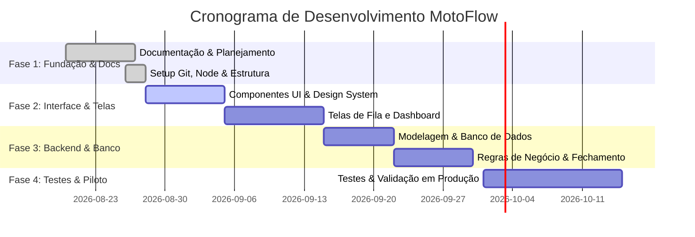

# 🗺️ Roadmap de Desenvolvimento — MotoFlow

> **Objetivo:** Estruturar o cronograma de entrega das funcionalidades do MotoFlow em ciclos ágeis (Sprints), garantindo foco, previsibilidade e organização nos commits do GitHub.

---

## 🚀 Fases do Projeto

---

## 📦 Detalhamento das Sprints

| Sprint | Foco Principal | Entregas Principais | Status |
| :---: | :--- | :--- | :---: |
| **Sprint 1** | **Fundação e Documentação** | Requisitos, Regras de Negócio, Modelagem e setup do repositório Git. | `Concluído` |
| **Sprint 2** | **Design System & Layout Base** | `layout.js`, `globals.css`, componentes base (`Button`, `Card`, `Badge`, `Input`, `Navbar`). | `Em Andamento` |
| **Sprint 3** | **Telas de Autenticação & Fila** | Tela de Login e Tela interativa da Fila de Motoboys (adicionar, ordenar, status). | `Planejado` |
| **Sprint 4** | **Lançamento de Entregas & Dashboard** | Lançamento de KM, vinculação de pedidos e métricas em tempo real no Dashboard. | `Planejado` |
| **Sprint 5** | **Fechamento de Caixa & Banco** | Cálculos automáticos de diárias/km, integração com banco de dados e persistência. | `Planejado` |
| **Sprint 6** | **Histórico, Testes & Piloto Real** | Relatórios de dias anteriores, execução dos Casos de Teste e validação na Babbo Giovanni. | `Planejado` |

---

## 🎯 Padrão de Commits Vinculados ao Roadmap
Ao trabalhar nas tarefas do roadmap, use os commits padronizados:
* `feat(fila): implementa ordenacao automatica de chegada`
* `feat(fechamento): adiciona calculo de taxas por km`
* `test(entregas): adiciona testes de validacao de km`
